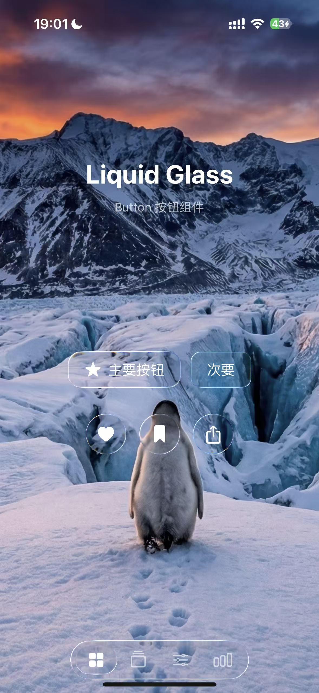

# LiquidGlassEffect

iOS 26 风格液态玻璃效果 Swift Package，基于 Metal 高性能渲染。

[](https://swift.org)
[](https://developer.apple.com/ios/)
[](LICENSE)

## 效果展示 (Previews)

| Button 按钮 | Card 卡片 | 动态演示 |
|:---:|:---:|:---:|
|  |  | [点击观看视频演示](docs/assets/demo_video.mp4) |

## 🔥 最新动态 (What's New)

### v2.0.0 - 性能架构大升级
- **🚀 共享背景上下文 (Shared Context)**: 新增 `LiquidGlassGroup`，多个组件共享同一背景捕获，CPU 负载降低 90%。
- **💾 全局纹理池 (Texture Pool)**: 智能显存管理，自动复用纹理，拒绝 OOM。
- **⚡️ 静态快照 (Static Snapshotting)**: 画面静止时自动冻结渲染，GPU 0% 占用，极致省电。

### v1.2.0 - 体验优化
- **🐛 零黑框**: 彻底修复后台恢复时的闪烁和黑框问题。
- **🌊 丝滑动画**: TabBar 气泡流动动画重构。
- **👆 智能帧率**: 滑动时自动升频至 60fps，静止时回落，告别视觉延迟。

## 特性

- 🎨 Metal 渲染的液态玻璃效果
- 🚀 高性能双缓冲纹理机制与智能节流（默认 30fps 背景捕获，60fps 光效渲染）
- 📱 iOS 15+ 支持
- 🎛️ 丰富的预设配置（regular、lens、subtle、thumb）
- 🧩 SwiftUI 原生支持
- 📦 完整的 UI 组件库

## 安装

### Swift Package Manager

```swift
dependencies: [
    .package(url: "https://github.com/Lincb522/LiquidGlassEffect", from: "2.0.0")
]
`````````

## 快速开始

```swift
import SwiftUI
import LiquidGlassEffect

struct ContentView: View {
    var body: some View {
        Text("Hello, Liquid Glass!")
            .padding()
            .liquidGlass()
    }
}
```

## 组件

| 组件 | 说明 |
|------|------|
| `LiquidGlassButton` | 液态玻璃按钮 |
| `LiquidGlassCard` | 液态玻璃卡片 |
| `LiquidGlassTabBar` | iOS 26 风格 TabBar |
| `LiquidGlassSlider` | 滑块控件 |
| `LiquidGlassTextField` | 输入框 |
| `LiquidGlassToggle` | 开关 |
| `LiquidGlassTag` | 标签 |
| `LiquidGlassNotification` | 通知卡片 |
| `LiquidGlassProgress` | 进度条 |

## 配置预设

```swift
.liquidGlass(config: .regular)   // 标准效果
.liquidGlass(config: .lens)      // 镜头效果
.liquidGlass(config: .subtle)    // 轻微效果
.liquidGlass(config: .thumb())   // 缩略图效果
```

## 性能优化

从 v1.1.0 开始，你可以控制背景捕获的帧率以节省电量：

```swift
// 背景每秒更新 15 次，但光效依然保持 60fps 流畅
.liquidGlass(backgroundCaptureFrameRate: 15.0)
```

## 致谢

- [LiquidGlassKit](https://github.com/DnV1eX/LiquidGlassKit) by Alexey Demin

## 许可证

MIT License
